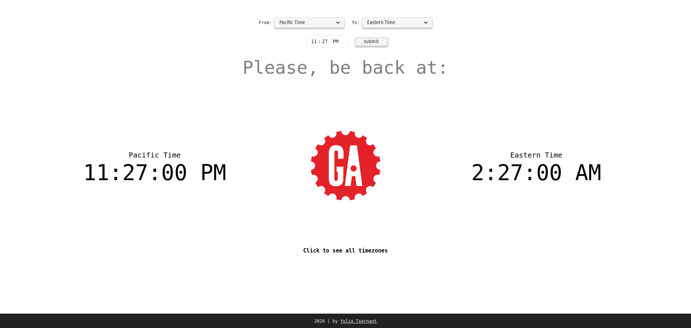

# GA Time Converter

Discovered that a lot of time savings can be achieved in an organization with a tool that automates timezone
conversion
Built an app that easily converts time between time zones of General Assembly campuses.
Used by 300+ instructors in 20 campuses across the United States.
Tech: JavaScript, HTML 5, CSS 3.

## Technologies Used
- JavaScript,
- HTML,
- CSS

## Link
<https://ga-time.github.io>
